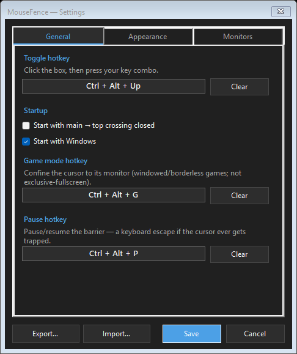
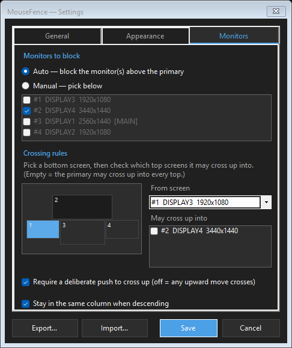

# MouseFence 🛡️🖱️

**A tiny Windows tray app that stops your mouse cursor from drifting into monitors you don't want it on — with per‑screen rules, a hotkey, and a "game mode" that confines the cursor to one screen.**

<p align="center">
  
  
</p>

---

## The problem

On a multi‑monitor setup the cursor slips onto screens you didn't mean to reach — a display stacked *above* your main one, a side monitor you only use sometimes, or it escapes the game you're playing. MouseFence puts an invisible, configurable barrier so the cursor stays where you expect it, and crosses only when you actually mean to.

## Features

- 🚧 **One‑way "up" barrier** — the cursor can't drift up into a monitor mounted above the main row by accident.
- 🎛️ **Per‑screen crossing rules** — choose exactly which bottom screen may cross up into which top screen (great for layouts with several monitors above). Empty = the primary may cross up into every top.
- 🔒 **Side screens stay put** — a screen with no rule can never cross up; the empty "void" corners above side screens stop trapping the cursor.
- 🎯 **Deliberate crossing (optional)** — by default a crossing takes an intentional upward push (fast horizontal slides and jitter never leak through); turn it off in Settings to let any upward move cross like a normal monitor edge.
- 🎮 **Game mode** — a hotkey that confines the cursor to whichever monitor it's on (so it can't escape a windowed/borderless game).
- ⌨️ **Global hotkeys** — toggle crossing (default **Ctrl + Alt + ↑**) and game mode (default **Ctrl + Alt + G**); plus a tray double‑click and a **Pause**.
- 🌗 **Light / Dark / Follow‑system theme** and **English / Türkçe** (auto‑detected from your OS).
- 🪶 **Safe & light** — it only watches the mouse; it **never changes your display arrangement**. DPI‑aware, single instance, no installer.

## How it works

MouseFence installs a **low‑level mouse hook** (`WH_MOUSE_LL`) and enforces a barrier line at the top edge of your bottom row of monitors. While the cursor is on the bottom row it can't go above that line — which blocks the top monitors *and* the empty void areas above side screens. Crossing up is allowed only through a **gate**: an X‑range opening (derived from your per‑screen rules) that a deliberate upward push, starting in that same opening, may pass. **Game mode** instead confines the cursor to the rectangle of the monitor it's currently on.

The barrier decision logic lives in a pure, Win32‑free class (`GuardCore`) with a deterministic test suite, so the tricky cases are verified without a multi‑monitor rig.

## Install

### Option A — download a release
1. Grab the latest `MouseFence.exe` from the **[Releases page](https://github.com/ydbilgin/MouseFence/releases)**.
2. Run it — it lives in the system tray, no installer, no window on launch.

> A framework‑dependent build needs the **.NET 9 Desktop Runtime**; a self‑contained build runs without it.

### Option B — build from source
You'll need the **.NET 9 SDK**.

```bash
git clone https://github.com/ydbilgin/MouseFence.git
cd MouseFence
dotnet run -c Release

# single-file exe (needs the .NET 9 runtime on the target machine)
dotnet publish -c Release -r win-x64 --self-contained false -p:PublishSingleFile=true
# or self-contained (bundles the runtime)
dotnet publish -c Release -r win-x64 --self-contained true -p:PublishSingleFile=true
```

## Usage

- The tray icon shows state: 🔴 crossing closed · 🟢 crossing open · ⚪ paused.
- **Toggle crossing** with the hotkey (default Ctrl + Alt + ↑) or a double‑click on the tray icon.
- **Game mode**: press its hotkey (default Ctrl + Alt + G) to confine the cursor to its monitor; press again to release.
- **Right‑click the tray** for: toggle crossing, game mode, pause/resume, Settings, Exit.
- **Crossing up** (where allowed): aim into the middle of the screen and push **straight up**.

## Settings

Open **Settings…** from the tray. Three tabs:

- **General** — the toggle hotkey, the game‑mode hotkey, start with crossing closed, start with Windows.
- **Appearance** — language (Automatic / English / Türkçe) and theme (Follow system / Light / Dark).
- **Monitors** — which monitors count as "top" (auto‑detect or manual), and the **crossing rules**: pick a bottom screen, then check which top screens it may cross up into. A read‑only mini diagram shows your layout.

Settings persist to `%APPDATA%\MouseFence\settings.json` (plain JSON; delete it to reset).

## Troubleshooting / FAQ

**The cursor still slips between displays.** Turn off Windows' **Settings → System → Display → Multiple displays → "Ease cursor movement between displays."**

**It doesn't work in some games.** Low‑level mouse hooks can't act over **exclusive‑fullscreen** games or **administrator** windows (run MouseFence elevated for the latter). Windowed/borderless games are fine — that's what game mode is for.

**I can't cross up even when it's allowed.** The crossing is deliberate: push **straight up** from the middle of the screen. Make sure crossing is open (green icon) and the rule allows that bottom→top pair.

**Mixed‑DPI monitors?** Handled — MouseFence is PerMonitorV2‑aware and works in physical pixels.

## Testing

The pure barrier logic (`GuardCore`) is covered by a deterministic scenario suite:

```bash
dotnet run --project tests\MouseFence.Tests.csproj -c Release
```

It covers side‑screen voids, origin‑aware diagonals, per‑screen multi‑gate rules, deliberate‑push thresholds, free roam + descent, and game‑mode confinement.

> The live cursor *feel* must still be verified by hand — the hook ignores injected/synthetic input, so it can't be exercised with simulated mouse events.

## Contributing

Contributions welcome. Keep the barrier logic in the Win32‑free `GuardCore` (so it stays testable), add/​update a scenario in `tests\Tests.cs`, and verify the feel by hand on a multi‑monitor setup before opening a PR.

## License

[MIT](LICENSE)
