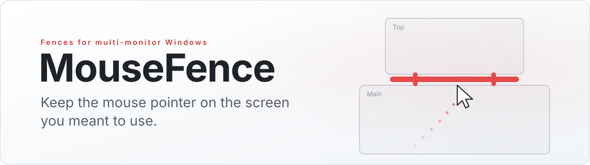
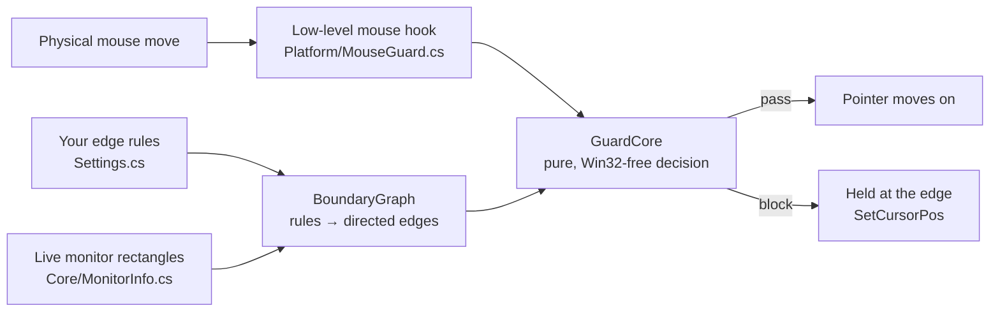

<!-- showcase:hero:start (generated from docs/showcase/showcase.yml) -->
<p align="center">
  <picture>
    <source media="(prefers-color-scheme: dark)" srcset="docs/media/banner-dark.svg">
    
  </picture>
</p>

<p align="center">A small Windows tray app that puts gentle fences on the edges between your monitors. It never changes your display layout.</p>

<p align="center">
  <a href="https://github.com/ydbilgin/MouseFence/releases/latest"></a>
  
  <a href="LICENSE"></a>
</p>

<p align="center">
  
  <br><sub><i>Illustration of the behaviour, drawn from the app&#x27;s own screenshots — not a screen recording.</i></sub>
</p>

<p align="center">
  <a href="https://github.com/ydbilgin/MouseFence/releases/latest"><b>Download</b></a>&nbsp;&nbsp;·&nbsp;&nbsp;
  <a href="#what-it-does"><b>What it does</b></a>&nbsp;&nbsp;·&nbsp;&nbsp;
  <a href="#install"><b>Install</b></a>&nbsp;&nbsp;·&nbsp;&nbsp;
  <a href="#everyday-use"><b>Use</b></a>&nbsp;&nbsp;·&nbsp;&nbsp;
  <a href="#build-from-source"><b>Build</b></a>&nbsp;&nbsp;·&nbsp;&nbsp;
  <a href="#questions"><b>FAQ</b></a>&nbsp;&nbsp;·&nbsp;&nbsp;
  <a href="#türkçe"><b>Türkçe</b></a>
</p>
<!-- showcase:hero:end -->

## The problem

With more than one monitor, the pointer slips onto the wrong screen all the time. A screen above your main
one catches it whenever you aim for a tab or a title bar near the top edge. A side screen pulls it out of a
borderless game in the middle of a fight. Windows lets you arrange your displays, but every shared edge is
always open.

MouseFence leaves your Windows display layout exactly as it is and only decides what happens when the
pointer reaches the edge between two screens.

## What it does

Click the small gate between two screens in **Settings → Displays** and choose what that edge does. Each
direction is set on its own: going up into the top screen can need a firm push while coming back down
crosses freely.

<!-- showcase:edges:start (generated from docs/showcase/showcase.yml) -->
<table>
<tr>
<td width="33%" align="center" valign="top">
<br>
<b>Crosses freely</b><br>
<sub>A normal Windows monitor edge.</sub>
</td>
<td width="33%" align="center" valign="top">
<br>
<b>Needs a firm push</b><br>
<sub>Slow drift stops at the edge; one quick, deliberate move crosses.</sub>
</td>
<td width="33%" align="center" valign="top">
<br>
<b>Never crosses</b><br>
<sub>The pointer stays on its side.</sub>
</td>
</tr>
</table>
<!-- showcase:edges:end -->

Around the edges:

<!-- showcase:features:start (generated from docs/showcase/showcase.yml) -->
<table>
<tr>
<td width="33%" valign="top">
<b>Keep pointer off</b><br>
<sub>Mark a screen the pointer must never enter; Windows keeps using it as normal.</sub>
</td>
<td width="33%" valign="top">
<b>Game mode</b><br>
<sub>Holds the pointer on whichever screen it is on, for windowed and borderless games.</sub>
</td>
<td width="33%" valign="top">
<b>Quick switches</b><br>
<sub>Upward passage, side protection and Pause, each with a global shortcut and a tray menu entry.</sub>
</td>
</tr>
<tr>
<td width="33%" valign="top">
<b>Crossing speed</b><br>
<sub>Tune how firm a firm push is, in pixels per second (default 3000).</sub>
</td>
<td width="33%" valign="top">
<b>Safety escapes</b><br>
<sub>After a layout change MouseFence keeps a way out of every screen, so the pointer is never sealed in.</sub>
</td>
<td width="33%" valign="top">
<b>Small and local</b><br>
<sub>Tray app, no installer, no network code; Light or Dark, English or Turkish, settings backup.</sub>
</td>
</tr>
</table>
<!-- showcase:features:end -->

## Install

1. Download **`MouseFence-win-x64.exe`** from the [latest release](https://github.com/ydbilgin/MouseFence/releases/latest).
2. Install the [.NET 9 Desktop Runtime](https://dotnet.microsoft.com/download/dotnet/9.0) if you do not have
   it yet (the release file is small because it uses the shared runtime).
3. Put the file anywhere, for example `%LOCALAPPDATA%\Programs\MouseFence\`, and run it. It starts in the
   system tray and opens no window.
4. To start it with Windows, turn on **Settings → General → Start with Windows**.

> [!NOTE]
> This README and its pictures describe the code on `main` (version 1.2.0, not released yet). The latest
> release, v1.1.1, has the same fences with an older look; 1.2.0 measures a firm push by the speed of the
> current move and adds a **Crossing speed** setting. To try it today, [build from source](#build-from-source).

## Everyday use

1. Right-click the tray icon and choose **Settings**. **Displays** shows your screens as Windows arranges them.
2. Optionally name each screen, or tick **Keep pointer off** for a screen the pointer should never enter.
3. Click a small gate where two screens meet, pick **Crosses freely**, **Needs a firm push** or
   **Never crosses**, and select **Save**.

To cross a firm-push edge, move to the middle of the shared edge and push straight across in one quick
motion. If it feels too stiff or too loose, change **Advanced → Crossing speed (px/s)** (default 3000;
higher feels firmer).

<p align="center">
  <picture>
    <source media="(prefers-color-scheme: dark)" srcset="docs/screenshots/boundary-editor-dark.png">
    
  </picture>
</p>

Double-click the tray icon to open or close upward passage; right-click it for the menu.

<p align="center">
  <picture>
    <source media="(prefers-color-scheme: dark)" srcset="docs/screenshots/tray-menu-dark.png">
    
  </picture>
</p>

Default shortcuts (change them in **Settings → Shortcuts**):

| Action | Shortcut |
|---|---|
| Upward passage on or off | `Ctrl + Alt + Up` |
| Side protection on or off | `Ctrl + Alt + Right` |
| Game mode | `Ctrl + Alt + G` |
| Pause MouseFence | `Ctrl + Alt + P` |

On a fresh install on a PC with Intel graphics, MouseFence adds `Shift` to the two arrow shortcuts, because
the Intel driver uses `Ctrl + Alt + arrow` to rotate the screen.

### Settings at a glance

Real captures of the app, drawn off-screen by its `--screenshot-demo` mode with a made-up three-screen layout
(Main 2560 × 1440, Top above it, Laptop to the right). Each picture follows your GitHub light or dark theme.

<!-- showcase:gallery:start (generated from docs/showcase/showcase.yml) -->
<table>
<tr>
<td width="50%" valign="top">
<picture>
  <source media="(prefers-color-scheme: dark)" srcset="docs/screenshots/displays-dark.png">
  
</picture>
<br><sub>Displays — your screens as Windows arranges them</sub>
</td>
<td width="50%" valign="top">
<picture>
  <source media="(prefers-color-scheme: dark)" srcset="docs/screenshots/advanced-dark.png">
  
</picture>
<br><sub>Advanced — defaults, crossing speed, safety</sub>
</td>
</tr>
<tr>
<td width="50%" valign="top">
<picture>
  <source media="(prefers-color-scheme: dark)" srcset="docs/screenshots/shortcuts-dark.png">
  
</picture>
<br><sub>Shortcuts — one global key for each switch</sub>
</td>
<td width="50%" valign="top">
<picture>
  <source media="(prefers-color-scheme: dark)" srcset="docs/screenshots/general-dark.png">
  
</picture>
<br><sub>General — theme, language, start-up, backup</sub>
</td>
</tr>
</table>
<!-- showcase:gallery:end -->

The interface is also available in Turkish
([edge editor in Turkish](docs/screenshots/boundary-editor-dark-tr.png)).

## How it works


```mermaid
flowchart LR
  A[Physical mouse move] --> B["Low-level mouse hook<br/>Platform/MouseGuard.cs"]
  B --> C["GuardCore<br/>pure, Win32-free decision"]
  D["Your edge rules<br/>Settings.cs"] --> E["BoundaryGraph<br/>rules → directed edges"]
  F["Live monitor rectangles<br/>Core/MonitorInfo.cs"] --> E
  E --> C
  C -->|pass| G[Pointer moves on]
  C -->|block| H["Held at the edge<br/>SetCursorPos"]
```

`BoundaryGraph` turns your saved rules into directed edges between the real screen rectangles. For each
physical move, `GuardCore` decides whether it passes, stops at the edge, or lands on an allowed screen; a
firm-push edge looks only at the speed of that single move. MouseFence reads screen positions and stable
monitor identities and never calls the Windows functions that rearrange displays or change display modes.

## Questions

**The pointer still jumps between screens on its own.**
Turn off Windows **Settings → System → Display → Multiple displays → Ease cursor movement between displays**.
That Windows 11 setting moves the pointer across edges for you and works against the fences.

**Does it send anything over the network?**
No. MouseFence has no network code: no telemetry, no update check. It stores only `settings.json` (plain
JSON; delete it to reset) and a small, size-limited `error.log` in `%APPDATA%\MouseFence\`.

**It does nothing over a game or an administrator window.**
Windows does not let a normal app steer the pointer over exclusive-fullscreen games or over programs running
as administrator. Windowed and borderless games work. Run MouseFence as administrator only if you need it
over an elevated program.

**The pointer cannot reach one of my screens.**
Open **Displays**: that screen is probably marked **Keep pointer off**, or the edge to it is **Never crosses**.
Also check in the tray menu that MouseFence is not paused.

**It will not start and says the settings file is invalid.**
MouseFence never overwrites a settings file it cannot read. Restore a backup from **General → Restore from a
file**, or delete `%APPDATA%\MouseFence\settings.json` to start fresh. Details are in `error.log`.

**How do I uninstall it?**
Turn off **Start with Windows** (it removes MouseFence's entry from your user's startup list), exit from the
tray menu, then delete the exe and the `%APPDATA%\MouseFence\` folder.

## Build from source

You need Windows and the [.NET 9 SDK](https://dotnet.microsoft.com/download/dotnet/9.0).

```powershell
git clone https://github.com/ydbilgin/MouseFence.git
cd MouseFence
dotnet run -c Release
```

A single-file exe that uses the shared .NET runtime, like the release (add `--self-contained true
-p:EnableCompressionInSingleFile=true` for one that carries its own runtime):

```powershell
dotnet publish -c Release -r win-x64 --self-contained false -p:PublishSingleFile=true
```

**Tests.** The test project is a console program, so use `dotnet run`, not `dotnet test`:

```powershell
dotnet run --project tests/MouseFence.Tests.csproj -c Release
```

It covers edge rules, firm-push speed, side protection, safety escapes, settings migration, the
English/Turkish texts, and the screenshot pictures.

**Screenshots.** The pictures above come from the app itself, drawn off-screen with made-up screens; nothing
is read from your monitors:

```powershell
dotnet build MouseFence.csproj -c Release -o build
build/MouseFence.exe --screenshot-demo docs/screenshots/displays-dark.png Dark 0 en
build/MouseFence.exe --screenshot-tray docs/screenshots/tray-menu-dark.png Dark en
```

The view number is `0` Displays, `1` Advanced, `2` Shortcuts, `3` General, `-1` edge editor, and `-2`
Advanced with the physical-pixel controls open. The last argument is `en` or `tr`. The illustration at the
top is rendered from `docs/demo/scene.html`; see [docs/demo/README-demo.md](docs/demo/README-demo.md).
More notes for contributors are in [docs/DEVELOPMENT.md](docs/DEVELOPMENT.md).

## Contributing, security, license

Contributions are welcome; [CONTRIBUTING.md](CONTRIBUTING.md) explains how to build, test and send a change.
Please report security problems privately as described in [SECURITY.md](SECURITY.md).
MouseFence is released under the [MIT license](LICENSE).

## Türkçe

**MouseFence**, çok monitörlü Windows kurulumlarında fare imlecinin yanlış ekrana kaymasını önleyen küçük bir
sistem tepsisi uygulamasıdır. Ekran düzeninize dokunmaz; yalnızca iki ekranın birleştiği kenarda ne olacağına
karar verir: serbest geçiş, kararlı bir itişle geçiş ya da hiç geçmeme. Bir ekranı tamamen imleç dışı
bırakabilir, oyun modunda imleci bulunduğu ekrana kilitleyebilirsiniz. Arayüz Türkçe de kullanılabilir.

- **Kurulum:** [son sürümden](https://github.com/ydbilgin/MouseFence/releases/latest)
  `MouseFence-win-x64.exe` dosyasını indirin, gerekirse .NET 9 Desktop Runtime'ı kurun ve çalıştırın.
- **Kullanım:** tepsi simgesine sağ tıklayıp **Ayarlar**'ı açın, iki ekran arasındaki kapıya tıklayıp
  davranışı seçin ve kaydedin. Ayrıntılar: [Everyday use](#everyday-use), sorular: [Questions](#questions).
- Ağ bağlantısı kurmaz; yalnızca ayarlarını ve küçük bir hata günlüğünü `%APPDATA%\MouseFence\` içinde tutar.
